# Five websites, five creative directions

Desktop and mobile UI/UX research • Reviewed September 15–16, 2026

This review treats each website as a designed product: what it is trying to communicate, how its visual system supports that purpose, what interaction adds, and where the experience breaks down. The strongest shared lesson is that distinctive websites build a repeatable visual language around a specific idea. Oversized type, dark backgrounds and animation alone do not provide that idea.

## Reading this research

**Observed** means I inspected the live page or exercised the control. **Source-confirmed** means public HTML/CSS/JavaScript contains the specific configuration or handler. **Hook only** means the markup suggests an interaction but its custom implementation was unavailable. **Interpretation** is my creative-direction assessment, not a measured business outcome.

Desktop inspection used chiefly 1280×720 and 1440px-wide views, with some larger-window observations. Mobile inspection used a **390×844 CSS-pixel viewport**. These were responsive browser tests with pointer/keyboard input, not physical iPhone/Android device tests. Screenshot frames show a moment in moving compositions, not the complete animation.

All five homepages were explored through their major sections. Navigation, galleries, menus, accordions and representative secondary templates were inspected. A separate public-source inventory covers **65 additional route requests** across Ace, MONOLOG and Lama Lama. It does not mean every case image, browser state, external client site or hardware gesture was tested. No forms were submitted, bookings made, AI prompts sent, purchases performed or camera access granted. There was no private repository access, Lighthouse benchmark or full accessibility certification.

- [Detailed public-source audit](source-audit.md): exact fonts, colors, breakpoints, motion settings and source URLs.
- [Typography, hierarchy and pointer follow-up](typography-hierarchy.md): rendered desktop/mobile measurements, information organization and additional live hover discoveries.
- [65-route inventory](route-inventory.md): every inspected response, template differences and incomplete pages.
- Screenshots throughout this report are captures from the live research session.

## Style map

| Website | Style / theme | Core creative idea | Best reference for | Main tension |
|---|---|---|---|---|
| [Ace](https://acedesign.io/) | Technical editorial; dark product studio; ASCII and lime | Precision, systems and small-team expertise | Quiet technical identity; persistent conversion rail | Mobile execution and inconsistent navigation |
| [Arkon Digital](https://arkon.digital/) | Cinematic creative coding; iridescent 3D; terminal typography | The site itself demonstrates the developer's craft | Persistent 3D scene across routes | Spectacle competes with text, especially on mobile |
| [Neue Montréal](https://neuemontreal.com/) | Swiss editorial; printed travel guide; colorful type exhibition | The typeface becomes the content and the interaction | Product-led motion and long-form art direction | Very long journey and custom-control accessibility |
| [MONOLOG](https://bymonolog.com/) | Warm monochrome; brutalist editorial; cinematic texture | A premium independent partner with a personal point of view | Sales narrative, work presentation and founder presence | Secondary-page completeness and experimental discoverability |
| [Lama Lama](https://lamalama.com/) | Swiss agency system; pixel graphics; cinematic presentation | An expressive agency identity applied to every interface layer | Coherent brand behavior; layered portfolio exploration | Many modes and controls increase learning effort |

## Themes across the collection

### Typography is the main identity system

The sites use remarkably few conventional interface decorations. Their hierarchy comes from font character, scale, spacing, weight and placement. Ace contrasts compressed Anton headings with restrained GT America and mono labels. Arkon uses a deliberate three-way contrast: elegant script, narrow industrial capitals and technical body text. MONOLOG alternates strong sans-serif statements, unusual display lettering and small mono annotations. Lama keeps its main sans family consistent and uses mono labels to make actions feel like instrument controls. Neue Montréal makes one family demonstrate an entire range of personalities.

The useful principle is **assign each typographic voice a job**. An expressive title, a readable explanation and a technical annotation can coexist if their roles stay consistent. Copying all the declared font files would miss the point: shared bundles often contain fonts that are not visibly important.

### Layout alternates restraint and release

Ace's fixed left rail provides stability while the right column changes. Arkon arranges content around a central object like a stage. Neue Montréal alternates dense editorial passages with enormous letterforms and immersive full-screen chapters. MONOLOG's small explanatory columns sit beside oversized statements and generous media. Lama mixes narrow control panels with broad image fields and compact project indexes.

Negative space does structural work. It gives a dominant element room, separates chapters and creates anticipation. It becomes a problem when users cannot tell whether the space is deliberate, content is still loading or an interaction is required. Empty published routes are a separate issue from intentional whitespace.

### Motion should have a reason

Three particularly strong reasons appear here: **demonstration** (Neue Montréal's variable weights), **proof of skill** (Arkon's real-time rendering), and **brand consistency** (Lama's pixel/logo treatment across media and controls). Ace's spinning seal and image degradation add a technical signature with less visual dominance. MONOLOG uses movement to support an editorial and persuasive sequence.

Persistent ambient motion has a different job from a click response. Ambient motion creates atmosphere; click motion should clarify what changed and where the user went. These sites sometimes mix those responsibilities. A morphing scene is memorable, but a clear selected filter, readable label and obvious close control still matter.

### Discovery is enjoyable until it hides the task

The rewarding discoveries include Lama's pitch deck and contact playground, MONOLOG's footer experiment, Neue's city stories and Ace's reactive image treatments. They are optional depth. Navigation, buying, reading and contacting should remain understandable without finding them. In particular, icon-only controls, unexplained horizontal strips and hover-dependent information deserve explicit touch and keyboard alternatives.

### Conversion is woven into the composition

Ace keeps booking beside the work on desktop. Arkon directs attention to the portfolio rather than a long lead form. Neue keeps a purchase link visible while visitors explore the specimen. MONOLOG develops trust through work, outcomes, process and FAQs before its closing invitation. Lama repeats contact access and turns its compact menu into a form/calendar/presentation hub.

These are different strategies for different offerings. A type specimen benefits from letting visitors play with the product; a studio must explain fit and credibility; a developer portfolio can use the interface as a live sample of capability. No conversion rates were measured here.

## Ace — technical editorial precision

**Creative assessment.** Ace communicates a small, selective studio focused on AI product design. The dark ground, sparse lime signals, registration-like corner marks and technical lettering connect the idea of craft to systems thinking. Its strongest feature is the consistency of those small decisions. Its largest weakness is that mobile QA does not yet match the confidence of the visual direction. [Live site](https://acedesign.io/)

### Typography, palette and layout

- **Type:** Anton supplies condensed uppercase service headlines. GT America Trial Light/Regular carries prose; GT America Mono supplies labels, names and testimonials. The custom ASCII image uses Chivo Mono; the orbiting seal uses Geist Mono. Those last two are component-specific, not general body fonts.
- **Color:** near-black surfaces including `#060606`, subdued white/gray text and acidic lime `#e1f435`. Cyan and other colors appear in secondary content; project artwork supplies most of the richer color.
- **Shape:** straight edges, fine borders, small corner ticks and rectangular controls. The effect is closer to a technical publication than a dashboard of rounded cards.
- **Desktop composition:** a fixed left area occupies roughly two-fifths of the screen, with a rotating seal/ASCII artwork, studio introduction and CTAs. The scrolling right area holds the narrative. The top navigation remains fixed.
- **Rhythm:** the right column alternates simple text with two-column project images and staggered outlined testimonial/service blocks. Deliberate empty cells make it feel composed rather than mechanically filled.

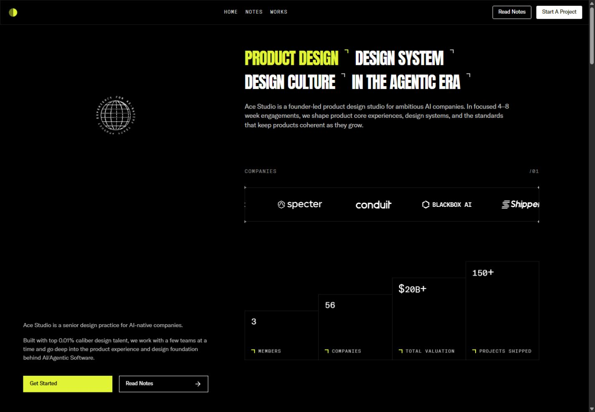

### Page sequence and secondary pages

The homepage moves from four service statements and an introduction to a moving company-logo strip, stepped numerical proof, six projects, testimonials, services, principles and a founder-led contact invitation. The counters settle at 3 members, 56 companies, $20B+ total valuation and 150+ projects shipped; these are site claims, not independently verified business figures.

The six work cards—Alpaca, Aster, Scout, Langdock, Twin and Marketer—use imagery to distinguish projects while their labels stay disciplined. Testimonials borrow a technical annotation style. This reinforces consistency but makes longer quotations feel small and low in the hierarchy. The service section repeats the outlined-grid language, with animated line symbols. Principle rows act as a concise manifesto and turn lime on pointer hover.

The [Notes page](https://acedesign.io/notes) is a long, narrow founder letter with large body text and cyan bracketed labels. It changes reading tempo appropriately; it is not a conventional article feed. The [Alpaca case](https://acedesign.io/work/alpaca) places metadata beside a large sequence of product screenshots. Public source confirms the other five cases share that general template, with mobile disclosure controls for metadata.

The published [Works route](https://acedesign.io/works) is an empty black page, confirmed both visually and in its page component. The [Laboratorium route](https://acedesign.io/laboratorium) instead shows a light personal-profile page, serif title, portrait, social circles and biography. That is a substantial identity change, with no clear experimental-lab framing in the opening view. Its intended relationship to the studio is unclear.

### Interaction and motion inventory

| Trigger | Response | Evidence | Design assessment |
|---|---|---|---|
| Scroll into statistics | Numbers count upward, then stop | Observed + source | Makes proof noticeable; final values must stay readable |
| Pointer over a principle | Full row becomes lime with dark text | Observed | Strong, immediate state change |
| Pointer over globe seal | Globe accelerates; circular text rotates independently | Rotation observed; acceleration source-confirmed | Small optional delight that fits the identity |
| Pointer over ASCII artwork | Circular inversion/deformation follows the pointer | Configured source | A material treatment related to the technical theme |
| Pointer/touch over footer portrait | Pixelated canvas layer changes opacity | Source-confirmed | More distinctive than a generic image zoom |
| Open mobile menu | Partial-height drawer with navigation and contact actions | Observed | Leaves page context visible underneath |
| Case metadata disclosure | Name/overview/scope content expands | Source-confirmed | Appropriate compression of secondary content |

The ASCII instance uses contrast 5, Floyd dithering, `@%#*+=-:.`, a smoothed circular inversion area and a 12px mono grid. The seal has counter-rotating text; configured hover boost doubles globe speed. Portrait pixelation is configured at 80px with spring stiffness 800, damping 60 and mass 1; touch clearing is delayed 500ms. These are implementation settings, not measured motion timings. Public Framer appearance code considers reduced motion for that subsystem; custom canvas/globe compliance was not established. [Source details](source-audit.md)

### Mobile changes and issues

At 390×844, the left sales/artwork rail disappears. The service headlines stack, the main flow becomes single-column, and stats/project cards become vertical. The top bar becomes a logo and hamburger; the desktop booking CTA is no longer persistently exposed there. The open drawer covers roughly the upper portion of the screen, with contact/booking below its links.

**Confirmed defect:** the introductory heading retains a **640px measured width starting at x=24** inside the 390px viewport. The surrounding layout clips the right side, cutting sentences mid-line. This is not just aggressive typography or an intentional oversized wordmark.

**Confirmed navigation inconsistency:** in the open mobile menu, Works led to `/notes`; Laboratorium's live link pointed to `/404`. The direct `/works` route is also empty. These need one consistent route/anchor model before further visual polish.

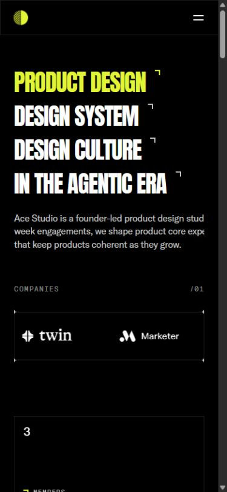

**What I would keep:** the fixed desktop rail, restrained lime, technical texture and clear project imagery. **What I would change first:** responsive text constraints, mobile route targets, empty Works, and the unexplained Lab identity. Then improve long-quotation readability and ensure the mobile contact path remains easy to find.

## Arkon Digital — a portfolio as a real-time scene

**Creative assessment.** Arkon immediately establishes creative-development capability by making its hero a functioning 3D composition. The object, reflective ground and type contrast create a distinctive signature. Its best decision is maintaining that world across routes. Its weakest decision is allowing the world to compete with information at narrow widths. [Live site](https://arkon.digital/)

### Typography, palette and layout

- **Type:** JetBrains Mono for technical prose/navigation; Bonheur Royale for the large flowing “Creative”; Bebas Neue for the condensed uppercase “Developer” and identity details.
- **Color:** black environment, gray `#b9b9b9` body text, white emphasis; iridescent cyan/magenta/violet come from the rendered object. The main white CTA has a pink/purple edge.
- **Desktop layout:** a full-viewport stage, large title left, central hovering sphere, biography and CTA right. Small metadata runs along the top; social links and Hong Kong time occupy the lower edges.
- **Hierarchy:** the unusual font pairing and sphere are equally strong focal points. The biography is intentionally subordinate, but it must still be legible.

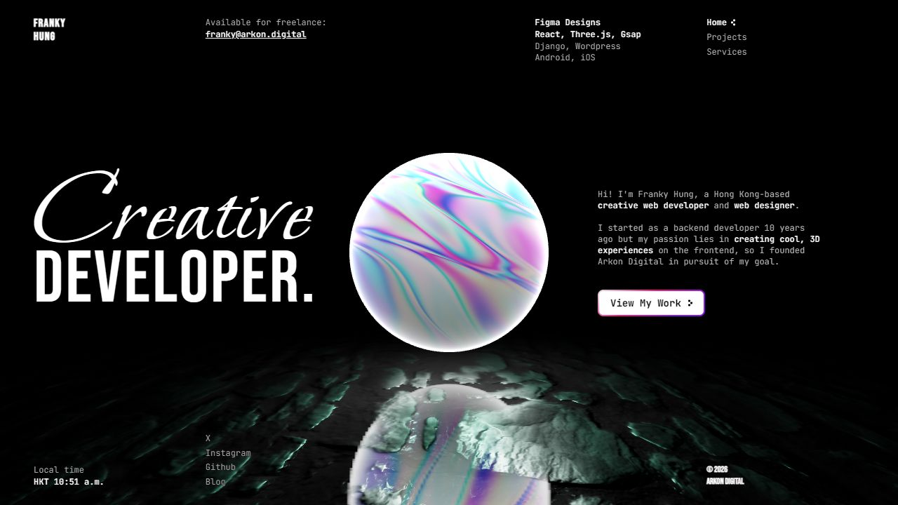

### Routes and interactions

The [Projects route](https://arkon.digital/projects) retains the scene but changes it to a blue particle sphere alongside the content. Recent and past projects have separate gallery controls. Each project combines explanatory text, technical labels, a large image and thumbnails. I clicked a secondary Modern Interior thumbnail and saw the large image change, then used Next Project to reach Lost in Boids. Previous is disabled at the first item. Pagination dots offer another route through the collection.

The [Services route](https://arkon.digital/services) relocates the particle composition and displays rows of outlined service/technology chips. Their pill styling suggests possible action, but the inspected items were text rather than controls. That makes the interface slightly ambiguous: either style these unmistakably as labels or provide meaningful interaction.

| Trigger | Response | Evidence | Design assessment |
|---|---|---|---|
| Home → Projects/Services | Solid sphere yields to particles; composition shifts | Observed + source | Excellent continuity between pages |
| Pointer movement | Lighting target responds subtly | Source-confirmed | Adds depth without requiring a separate cursor toy |
| Thumbnail click | Replaces the primary project image | Observed | Conventional, understandable gallery behavior |
| Next/previous/dot | Changes selected project | Observed controls; next exercised | Useful inside a compact portfolio |
| Link hover | Arrow appears, text strengthens | Source-confirmed | Clear micro-feedback |
| CTA hover | Scale increases to 1.05 | Observed in follow-up + source | Simple tactile emphasis |

The scene uses React Three Fiber, a shader sphere, particles, lights and a reflective ground. Source shows pointer interpolation of a spotlight, so this is not simply an autoplay video. Route changes combine roughly .5s page fades with 1.5s particle transformations using `power2.inOut`. Lenis uses lerp .1 and duration 1.5, with smooth touch scrolling disabled. The circular loading treatment develops into a glow before fading. These code settings explain intent; loading time and frame rate were not benchmarked. [Source details](source-audit.md)

External Live Demo destinations advertise further experiments. They are separate sites and were not tested as part of the Arkon interface audit.

### Mobile changes and issues

The three navigation links remain visible rather than becoming a hamburger. Availability, technology columns and the clock are removed. The hero title moves up; biography and CTA move lower; the sphere occupies much of the center. Projects stack text before media, retaining thumbnails, dots and smaller arrow controls.

**Observed readability problem:** white body text crosses the brightest part of the moving sphere. The changing surface makes contrast unstable. The reflection also competes with lower social/footer text. A quiet scrim or an explicit text zone would preserve the spectacle while protecting reading.

**Source-confirmed accessibility concern:** the viewport declares `user-scalable=no` and a maximum scale of 1. That restricts intended zoom behavior, although actual browser enforcement varies. Remove the restriction and test zoom/reflow. The persistent canvas should also have a lower-motion/lower-cost mode; no claim is made here that it currently lacks every such mechanism.

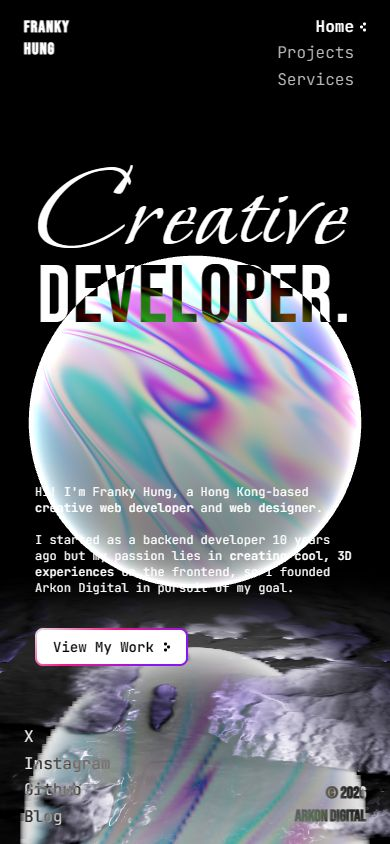

**What I would keep:** the route-aware shared scene and distinctive font contrast. **What I would change first:** mobile text placement, zoom restrictions and label/control differentiation. I would evaluate performance on ordinary phones before adding another visual effect.

## Neue Montréal — a living type specimen

**Creative assessment.** This is the clearest example of interaction serving the actual product. Variable weights, optical styles, ligatures and alternates become experiences visitors can see, compare and manipulate. The Montréal travel-guide concept supplies enough imagery and editorial material to hold a very long page together. It is the richest reference here for art-directed product education. [Live site](https://neuemontreal.com/)

### Typography, palette and layout

- **Type:** PP Neue Montreal and PP Neue Montreal Text, including variable and italic faces. Display weights span Hairline through Black; the Text family provides a smaller weight range. The product supplies the interface's identity.
- **Color/material:** dark `#1a1a1a`, paper `#f0e7d4`, red cover, and saturated pink, green, yellow, blue, orange and violet chapters. Grain, postcards, tickets and folded paper tie the digital work to printed ephemera.
- **Grid:** editorial columns and fine rules give way to edge-to-edge word specimens. Contrast comes from density and scale rather than adding cards around everything.
- **Navigation:** fixed rounded identity/purchase pills flank a central desktop section-navigation pill. This softer chrome separates controls from the large printed composition.

The inspected desktop cover showed overlapping introductory text/rules at 1280×720 on repeat visits. The mobile cover resolved into a clearer stack. Treat the desktop overlap as a captured layout/rendering issue at that size; the underlying cause was not diagnosed.

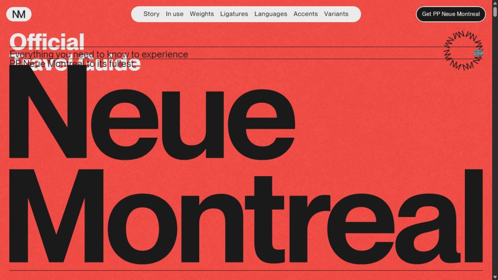

### The complete editorial journey

The page begins with a red travel-guide cover and enormous type, then a dark manifesto using alternating colorful words. Postcards lead into the history/story section, text/display weight lists and a timeline. Orbiting sample images introduce another change of pace. Video-backed, scroll-driven weights then turn typography into a live demonstration.

Eleven colored city-attraction panels associate places with weights and hide editorial copy inside an accordion. A cream Text-versus-Display comparison uses oversized lowercase forms, followed by a larger split-character section that exposes differences in construction. Three colored ligature circles are followed by a selectable weight chart.

The later chapters cover languages using flags/exhibition imagery, diacritics through diagonal strips, printed tickets, animated punctuation, and a folded brochure that opens with scrolling. A variants strip introduces related products before the red footer and oversized name return the visitor to the cover's visual language. The measured page was roughly 19,800 CSS pixels tall at one desktop size, illustrating the length rather than a fixed universal dimension.

### Interaction and motion inventory

| Trigger | Response | Evidence | Why it matters |
|---|---|---|---|
| Scroll weight chapter | Display moves Black → Hairline while Text grows heavier | Observed + source | Makes the variable design space understandable |
| Click a colored city panel | Selected story opens; other panels compress | Observed | Combines specimen and editorial discovery |
| Choose Hairline/other weight | Main chart specimen updates visibly | Observed | Gives direct control over the product |
| Switch Display → Text | Available weights and specimen change | Observed | Communicates optical-family differences |
| Pointer over postcards | Tilt/gravitation with return on leave | Tilt observed in follow-up; return behavior source-confirmed | Reinforces physical printed-object metaphor |
| Orbiting images enter view | Fan outward and rotate around center | Observed motion + source | Keeps a dense specimen collection visually light |
| Scroll split glyph | Optical/weight comparison changes spatially | Observed + source | Turns tiny typographic differences into large evidence |
| Ambient punctuation/variant cycle | Forms alternate and morph | Observed + source | Shows alternate construction rather than random movement |

The configured variable-weight mapping runs display 900→100 against Text 200→700 and completes by .7 of its configured scroll progress. The orbit rotates once per 40 seconds and pauses offscreen; its inspected component has no drag handlers, so it should not be described as a draggable carousel. Desktop postcard tilt permits 20° and scale 1.1; mobile variants reduce tilt to 1° and scale 1. Punctuation uses a .8s morph and 1s pause. Variant switching runs every 1800ms; the wave headline uses a 1.4s duration and .07s character stagger. [Source details](source-audit.md)

### Mobile changes and issues

The strongest responsive change in this set is the city accordion: desktop's narrow vertical color panels become **stacked horizontal rows** with names, numbers and chevrons. I opened the Biosphere row and inspected the expanded story. It preserves the color/weight concept while changing the interaction geometry for a narrow screen.

The hero stacks; ligature circles become vertical; postcard tilt is reduced. Some comparisons remain side by side to preserve their meaning. The weight tester continues to work, including switching from Display to Text and reducing the available weights appropriately.

The central section navigation disappears at mobile width, while the logo and purchase control remain. I did not find a replacement top-level section menu in that header. On a roughly 17,000px mobile page, that trades orientation for cleaner presentation. A compact chapter menu would be useful without undermining the design.

The inspected weight controls use custom elements rather than native buttons/inputs. That does not by itself prove total inaccessibility, but keyboard operation, focus indication and programmatic selected state need an explicit audit. Several specimens are SVG paths rather than ordinary text, making meaningful surrounding labels especially important.

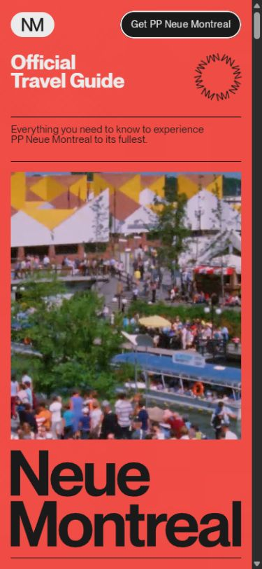

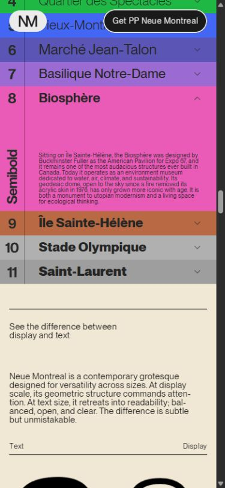

**What I would keep:** the travel-guide concept, purposeful motion, extreme type scale and component-specific responsive decisions. **What I would improve first:** mobile chapter navigation, semantic/focus behavior of custom controls and the captured desktop-cover overlap. Preserve the spectacle but let a returning visitor reach a particular specimen quickly.

## MONOLOG — warm editorial confidence

**Creative assessment.** MONOLOG balances a strong designer's voice with a recognizable sales journey. It is less about a single hero effect than a sequence: problem, credibility, work, services, process, objections, invitation. The warm neutrals, founder presence and unusual display lettering make that familiar structure feel personal. Its published secondary routes currently weaken the impression of completeness. [Live site](https://bymonolog.com/)

### Typography, palette and layout

- **Type:** KHTeka for primary interface/body and bold statements, Animo Normal Regular for expressive display, Suisse Intl Mono for metadata. CSS defines display sizes roughly 5–9.25rem and very tight tracking/leading; these are system ranges, not one screenshot measurement.
- **Color:** warm black `#080807`, dark cards `#181715`, beige `#e8e8e3` and intermediate warm grays. This tonal warmth distinguishes it from a pure black/white tech portfolio.
- **Texture:** grain/halftone and cinematic moving imagery give the background a tactile quality. A wireframe torus appears above the central hero copy; the huge wordmark anchors the bottom.
- **Composition:** small left-side annotations or testimonials counterbalance larger statements and media on the right. Light work sections interrupt dark chapters. The design uses asymmetry consistently rather than arbitrarily.

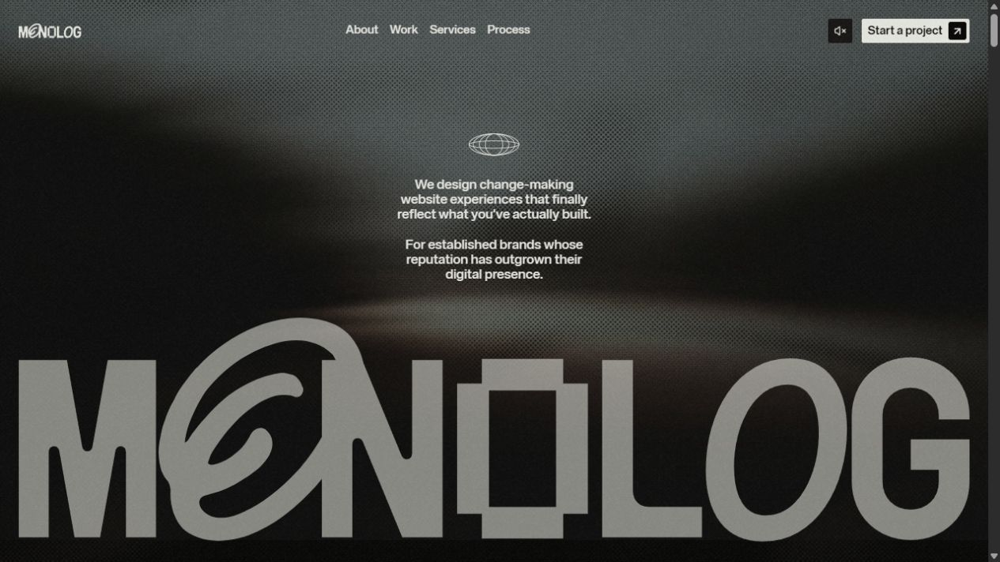

### Narrative and secondary surfaces

The hero establishes the studio's positioning, then a founder/problem statement and smaller credibility elements explain why the visitor should care. Large expressive words with changing images lead into a light portfolio section. Project presentations combine prominent imagery with short summaries and outcome language. Services return to dark, large type with contextual imagery; process steps use real working material and links to timestamped video explanations. FAQs handle practical questions before the large closing CTA.

About is an independently scrolling cream panel over a blurred/darkened page. It contains founder context, imagery, client/award material and values. The desktop panel occupies approximately the right half; **Escape successfully closed it**. Its presentation makes the founder feel present without requiring a conventional About route.

The [Work index](https://bymonolog.com/work) has a cream background, seven-project grid and service filters. I selected Brand Strategy and the grid reduced to OH Architecture and Mammoth Murals. The large heading count stayed “07,” which can be read as total archive size but is ambiguous beside a filtered set. Clarify total versus results rather than leaving users to infer the distinction.

The work cards inspected link to external client websites. Separately, all seven `/projects/…` URLs listed in the sitemap returned generic old navigation/footer shells in source. I opened [OH Architecture's project route](https://bymonolog.com/projects/oh-architecture) in-browser and confirmed the absence of a case study. This is a published-route/content problem; it is not evidence that the primary external work-card links all fail.

### Interaction and motion inventory

| Trigger | Response | Evidence | Design assessment |
|---|---|---|---|
| About | Cream biography panel overlays the page | Observed | Strong personal layer with preserved page context |
| Escape in About | Panel closes | Observed | Good keyboard exit convention |
| Service pointer state | Current service brightens and related image changes | Observed state + matching hooks | Gives a sparse list visual depth |
| FAQ selection | Row highlights beige; answer expands | Observed pricing question | Clear disclosure and readable state contrast |
| Work service filter | Grid narrows to matching projects | Observed | Useful for prospective-client relevance |
| Process preview | Links to a corresponding video timestamp | Link targets observed | Makes process claims more tangible; videos not played here |
| Footer hold area | “Hold to disrupt” cursor prompt; canvas texture reacts | Prompt observed, drag partially probed, handler unavailable | Memorable optional experiment; exact sustained-press behavior not fully verified |
| AI service icon | Opens a prefilled external evaluation prompt | Link targets observed | Unusual partner-research aid; not an on-site chatbot |

The AI links include Claude, Gemini, ChatGPT, Grok and Perplexity. Their role is to invite outside evaluation of the studio. They were inspected without sending anything. A short label explaining the destination would improve clarity for people who do not recognize the icons.

A sound toggle is present and initially off. I did not turn it on, so this report does not describe the audio design as heard. Source loads GSAP/ScrollTrigger/SplitText/Flip, Three.js, Lenis, Howler and Barba. MONOLOG's custom bundle rejected direct HTTP access with an invalid-referrer response; no bypass was attempted. Consequently testimonial automation, values-accordion details and the precise footer shader behavior remain hook-only unless specifically observed above. [Source details](source-audit.md)

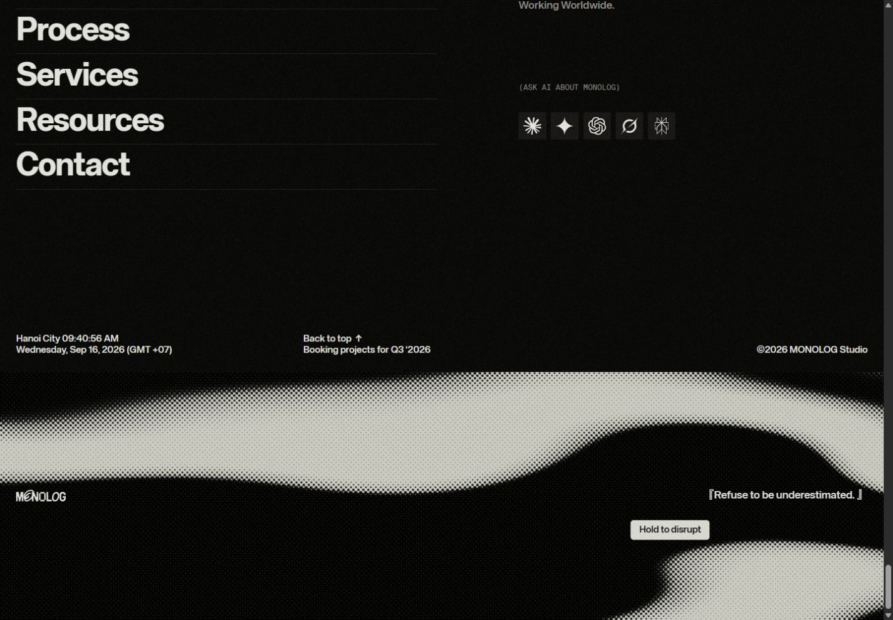

### Mobile changes and issues

The mobile header keeps logo, sound control and Start a project, then adds Menu. The hero becomes a tall composition with small centered copy and the large wordmark near the bottom. The menu opens a dark panel with large About/Work/Process/Services/Contact links. About changes from a side panel to a full-width reading surface, preserving its close control.

The menu also exposed two small editorial/news cards with a duplicated headline and placeholder `#` links. One displayed a future September 21, 2026 date relative to this review. This may be scheduled or unfinished content; the duplicated/placeholder presentation is the stronger finding. Clean these secondary surfaces, because visitors exploring a craft-focused studio are particularly likely to notice them.

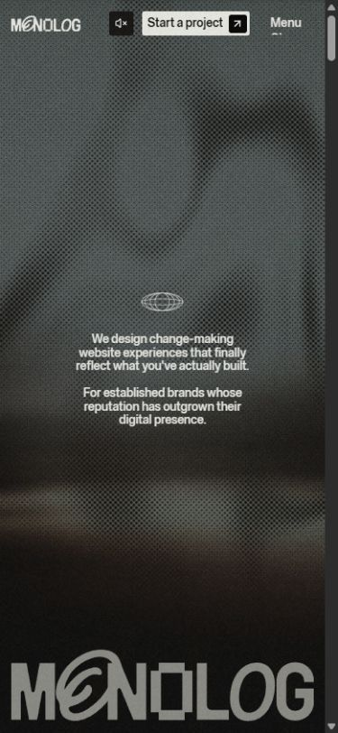

**What I would keep:** the warm palette, narrative order, light/dark chapter rhythm, personal About panel and practical FAQ. **What I would change first:** generic project routes, menu placeholders and filtered-result labeling. Then make experimental/AI affordances understandable without relying entirely on cursor text or brand-icon recognition.

## Lama Lama — a complete brand behavior system

**Creative assessment.** Lama Lama is the most extensive interaction system in this group. Its distinctive quality is not the number of effects: pixel treatment, mono scrambling, compact controls, contextual messages, media and presentation mode all feel related. It turns the agency's personality into a reusable interface language. The cost is complexity—users have to understand several overlapping modes. [Live site](https://lamalama.com/)

### Typography, palette and layout

- **Type:** Suisse BP International across weights 300–700, paired with Sometype Mono. Large bold uppercase titles use tight tracking and line-height as low as .8. Body is more open, generally 14–16px at the regular token range; micro labels are 10px uppercase mono.
- **Color:** dark `#1a1c1c`, off-white `#f9f4eb`, pink `#ffc6da`, red `#e75d60`, green `#d0ff7e` and pale blue `#dcf2f4`. Dark, light and pink theme mappings govern content, background and cursor treatments.
- **Header:** a centered compact panel, maximum width 438px, holds the pixel logo, a changing contextual phrase and menu control. It is an interface object floating above the page, not a conventional full-width header.
- **Composition:** cinematic full-bleed hero media; large title lower left and supporting text lower right on desktop. Compact rows and broad media areas alternate below. Small utility cards float on the right.

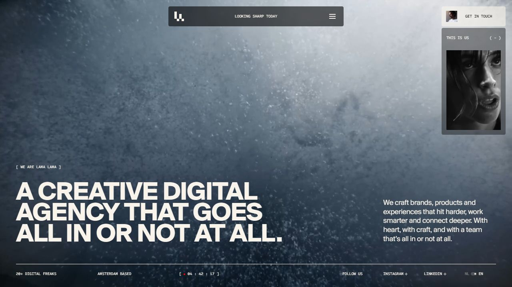

### Page sequence and secondary templates

The homepage moves from its media-led introduction to featured work rows, services, client logos, culture imagery and a contact close. Each work row pairs the project name and category tags with an image strip. On desktop, opening Neurons Lab expanded a gallery and narrative inside the page; dragging changed the visible media. This gives browsing depth before requiring a case-page visit.

The services section combines large type with lists of capabilities. Client logos add a quieter horizontal rhythm. Culture images use deliberately unequal sizes and offset placement. The footer repeats contact and scheduling with a recognizable person attached to the phone CTA.

The [Work index](https://lamalama.com/work/) expands this same system into 40 projects. Its floating filter tray is functional: selecting E-commerce changed the address to `?type=e-commerce`, reduced the count to 6 and displayed matching rows. This is a strong detail because the filter has a persistent, shareable state. [Filtered view](https://lamalama.com/work/?type=e-commerce)

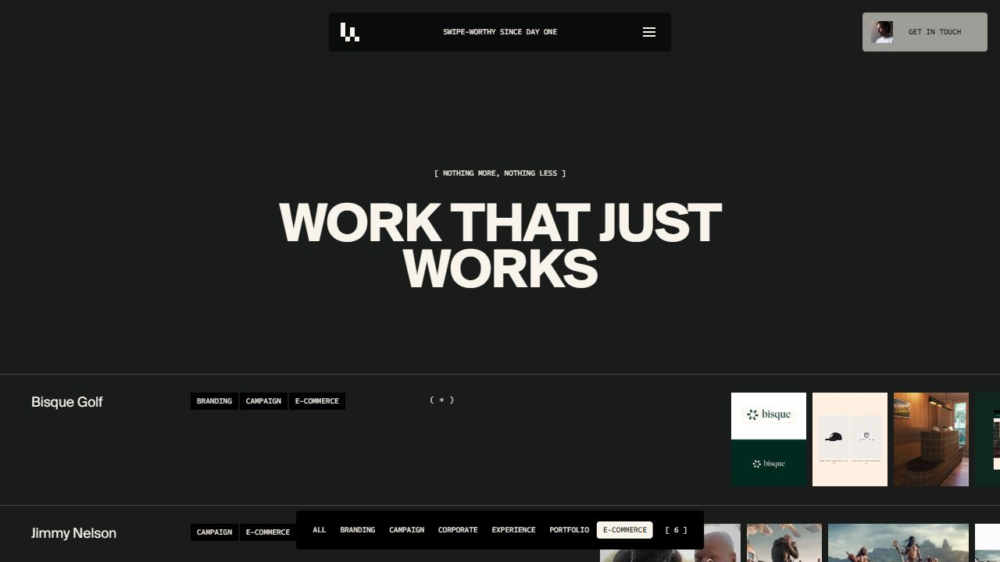

The [Moov case](https://lamalama.com/cases/moov/) uses a large title, category tags, short narrative, credits and an extensive media sequence. Back to work stays available at the top. The inspected case family generally shares this structure and ends with related projects and contact. The source inventory covers all 41 English case sitemap URLs, including one redirect, so template reuse and exceptions are documented rather than inferred from one page.

Public source also shows dedicated light service templates with process stacks, related work and contact; About contains values, awards, team selection and a culture gallery. The [AI route](https://lamalama.com/ai/) is sparse, with a title and standard close, while [Cubby's case](https://lamalama.com/cases/cubby/) contains lorem ipsum in its primary narrative. These source-confirmed content gaps deserve an editorial pass. A duplicate `/cases/10-10/` URL correctly redirects to `/cases/10-out-of-10/`; that redirect itself is not a broken experience. [Route inventory](route-inventory.md)

### Hidden interfaces and motion

| Surface / trigger | What happens | Evidence |
|---|---|---|
| Menu | Compact panel expands over blurred content, with service submenu and inquiry actions | Observed |
| Our pitchdeck | Opens a separate ten-slide presentation with thumbnail navigation | Observed |
| Pitchdeck keyboard | ArrowDown advanced the desktop deck; thumbnail-list control exposed the slide index | Observed |
| Pitchdeck close | Explicit X works; Escape did not close it in the tested desktop state | Observed |
| Showreel utility | Opens custom full-screen video with seek, mute, pause and close controls | Observed; video playback verified |
| Work row, desktop | Inline case preview opens; gallery can be dragged | Observed Neurons Lab |
| Work row, mobile | Tested Ajax plus opened the dedicated case URL | Observed; materially different from desktop preview |
| Work filter | Updates matching rows, count and query parameter | Observed E-commerce |
| Start a project | Menu region transforms into a stepped form with progress and focused field | Observed first stages; not submitted |
| Scroll through chapters | Header phrase/logo state and utility cards change with context | Observed + source |
| Contact grid settings | Reveals adjustment surface around the pixel/video treatment | Observed opening; deeper camera flow source-only |
| Activate camera | Requests camera and renders its stream through the branded grid | Source-confirmed; deliberately not activated |
| Team list | Hover changes portrait, marks the row and reveals a personality caption | Observed in follow-up + source |
| Culture gallery | Desktop gallery moves horizontally | Source-confirmed, not fully exercised live |
| Awards image / mobile button | Desktop hold reveals awards; mobile button expands a persistent table | Desktop handler source-confirmed; mobile expansion observed in follow-up |

The deck is a genuine alternate way to understand the agency, not a PDF download. Source defines ten slides, arrow navigation and desktop wheel/vertical movement. Below 1000px, it changes to horizontal movement with swipe and left/right tap zones. I opened the mobile deck, but did not fully verify all touch navigation on a physical device. Its desktop X works; adding a reliable Escape behavior would align it with familiar modal expectations.

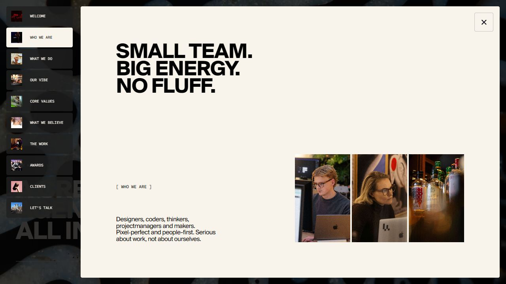

The showreel's controls disappear after inactivity—source says 2 seconds on desktop and 4 on touch—and return on movement. Opening it pauses background rendering; closing mutes/pauses the video and restores the background. Actual playback was verified rather than treating generic fallback text in the DOM as a playback error.

The inquiry form asks project type, name, email, optional company and message. Next advanced beyond an unselected project type; it did not progress beyond an empty name in the tested state. I did not observe a clear inline error message in that moment. Public code includes focus/validation behavior, previous/cancel actions, Enter shortcuts and success/error panels. Submission outcomes are untested. The scheduling route uses an embedded Cal.com introduction calendar in source.

The [Contact page](https://lamalama.com/contact/) is an additional discovery: a moving image is rendered through a fine grid, with camera activation and grid settings. Code maps the slider to grid size, supports dark/light colors and stops camera tracks on revert/destruction. The actual camera request was not made. An apparent missing DOM insertion in one error-message method is a source concern to test, not a confirmed user-visible failure.

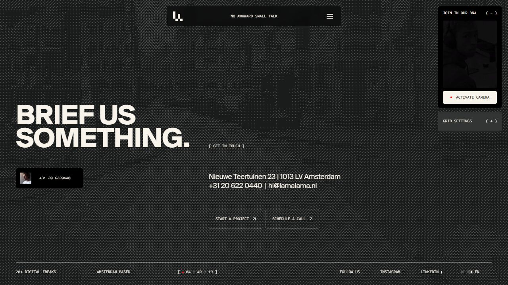

The rendering system includes a shader that draws the LL logo, an 8px grid and a pointer distortion field that decays over time. Rich cursor behavior is disabled for touch or unsupported graphics capabilities. Button hover scales the backdrop to .98, swaps arrows and reveals mono text, mostly using .25–.45s `power4.out`. The shared stack system clips older cards as later cards arrive, with progress lines. These behaviors connect micro-interactions to the same visual language as the larger media transitions. [Source details](source-audit.md)

### Mobile changes and issues

The header becomes nearly full available width. The desktop floating contact utility is removed from the initial mobile composition, while the showreel access appears within the expanded menu. Hero title and body stack toward the lower portion of the tall screen.

Work rows become larger vertical units: title, tags and a horizontal image strip. Importantly, the tested Ajax plus went directly to `/cases/ajax/`, rather than reproducing the desktop inline expansion. Service columns become a horizontal strip of large outlined cards with a progress indicator; dragging from Branding to Digital worked. This is an intentional responsive behavior change, not accidental overflow.

The deck retains a full-height presentation treatment and close control at mobile width. Micro labels remain small. The menu, deck, showreel and form each have different states and exits, so a final interaction QA pass should cover back behavior, focus return, screen-reader naming and Escape consistently across them. No full certification is implied by the presence of accessibility-related code.

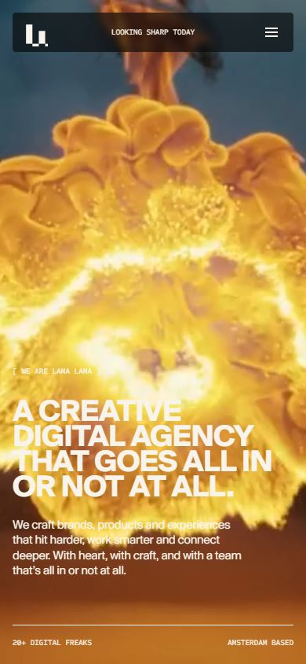

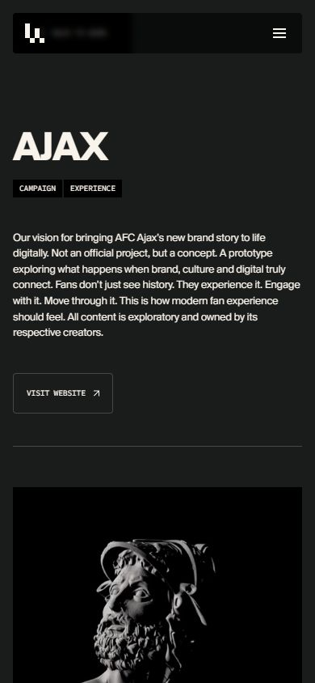

**What I would keep:** the shared pixel identity, compact menu hub, desktop inline previews, persistent filter URL and intentional mobile service strip. **What I would change first:** modal exit consistency, explicit field-error feedback and incomplete content. Then check whether the smallest mono labels remain comfortable on real phones and whether each hidden surface is discoverable without explanation.

## Deeper typography, hierarchy and pointer findings

The [focused follow-up](typography-hierarchy.md) adds measured type scales and explains how information is prioritized. It also documents new live pointer evidence: Ace's project images zoom to 1.05, Arkon's CTA grows and navigation arrows appear, Neue's postcards tilt and purchase letters roll, MONOLOG's service list changes emphasis with its preview, and Lama's team rows reveal portraits and individual personality captions.

An additional responsive discovery is Lama's awards: desktop uses a press-and-hold reveal in its implementation, while mobile supplies a persistent View our awards disclosure that was opened and verified. The follow-up distinguishes that source-confirmed desktop behavior from the live mobile test.

## Desktop → mobile comparison

| Site | Navigation | Content / composition | Interaction adaptation | Most important mobile concern |
|---|---|---|---|---|
| Ace | Full nav/CTAs → logo + partial-height menu | Fixed rail removed; cards/stats stack | Menu exposes extra routes; case metadata has disclosures in source | 640px intro clipped; Works misroutes |
| Arkon | Three route links stay visible | Title up, bio down, central sphere remains dominant | Gallery controls persist; prev/next become smaller | Unstable contrast over sphere; zoom restriction |
| Neue Montréal | Central chapter pill disappears; purchase stays | Long vertical specimen; circles stack; comparisons selectively stay paired | City accordion becomes horizontal rows; tilt greatly reduced | Long-scroll orientation and custom-control semantics |
| MONOLOG | Adds Menu; Start a project remains | Tall hero; About fills width | Large menu links and full-width biography | Placeholder menu cards and incomplete published case routes |
| Lama Lama | Compact menu expands to nearly screen width | Hero stacks; work rows grow; services become horizontal cards | Desktop inline case preview → tested direct case navigation; deck has mobile-specific source behavior | Small labels; differing layer/exit conventions |

Responsive quality here is best judged by **what gets rethought**, not only by whether columns fit. Neue's accordion and Lama's services are strong examples. Ace's introduction demonstrates the opposite: changing the outer layout without releasing an inner fixed width breaks the reading experience.

## What I would send back to the teams

These priorities are editorial recommendations based on observed impact, not formal severity scores from a full QA program.

| Priority | Site | Finding | Evidence / next action |
|---|---|---|---|
| Fix first | Ace | Mobile introduction is clipped | Measured 640px inner width at 390px; use responsive width and recheck wrapping |
| Fix first | Ace | Mobile Works goes to Notes; Lab points to /404; /works empty | Live navigation/DOM + route source; align links and destinations |
| Fix first | Arkon | Hero body crosses bright sphere | Live mobile screenshot; create a stable text-safe area |
| Fix first | MONOLOG | Published case routes show generic shells | All seven source responses, one live confirmation; complete, redirect or remove from sitemap as appropriate |
| Fix next | Arkon | Zoom-restricting viewport settings | Source; allow scaling and test reflow |
| Fix next | Neue Montréal | Desktop cover text/rules overlap at 1280px | Repeated captured state; diagnose sizing/animation/font-loading interactions |
| Fix next | Neue Montréal | Mobile long page loses chapter navigation | Live responsive header; add compact chapter access |
| Fix next | MONOLOG | Menu content placeholders and unclear filtered count | Live menu/filter; finish content and distinguish total/results |
| Fix next | Lama Lama | Deck Escape exit and form-error clarity | Tested state; harmonize layer controls and show errors beside fields |
| Fix next | Lama Lama | Cubby placeholder narrative; sparse AI page | Source; editorial completion or deliberate removal from published discovery |
| Validate | All | Reduced motion, focus, touch, contrast and device performance | Targeted follow-up required; no benchmark or compliance claim in this report |

## Principles worth taking into a new design

1. **Choose a concept before choosing effects.** Technical precision, a live coding stage, a travel guide, a founder's editorial voice and a pixel-based agency identity are distinct starting points.
2. **Give motion an explanatory job.** A changing weight shows a font capability; a persistent scene links routes; an opening row exposes portfolio depth. These are easier to justify than an unrelated decorative effect.
3. **Keep a quiet place to read.** Large media can surround the copy, but the copy still needs stable contrast and a sensible line length.
4. **Separate expression from control clarity.** Brand the button's behavior, but preserve recognizable selection, focus, labels and exits.
5. **Design mobile interactions deliberately.** Replace a desktop arrangement when its geometry no longer works. A vertical accordion or horizontal service strip can preserve the idea better than shrinking it.
6. **Make hidden interactions optional rewards.** A visitor should be able to assess the work and contact the team without finding the experiment.
7. **Audit the edges of the experience.** Sitemaps, old project URLs, menus, footer links and validation states are part of the delivered design. The most polished homepage does not compensate for an empty destination.

My strongest references by purpose are **Neue Montréal for product education**, **Lama Lama for a coherent interaction language**, **MONOLOG for narrative and trust**, **Ace for restrained technical art direction**, and **Arkon for demonstrable creative-development skill**. These are qualitative judgments about this research set, not claims about which site converts best.

## Evidence and remaining limits

The [source audit](source-audit.md) links exact public assets and distinguishes actual component invocations from library presence. The [route inventory](route-inventory.md) documents 65 response checks: 8 Ace routes, 8 MONOLOG routes and 49 Lama routes. Arkon's three main routes and Neue's one-page structure were inspected separately. Dutch versions, external portfolios/demos and transactional destinations were not exhaustively duplicated.

Screenshots are direct captures. No image-generation or remote-media downloads were used. Some animations, particularly pointer effects and mobile touch handling, were explained from inspected implementation instead of claiming they were all exercised. Real-device Safari/Chrome, sustained long-press, screen readers, full keyboard traversal, reduced-motion preferences, slow-network loading and measured frame rate remain outside this review.
