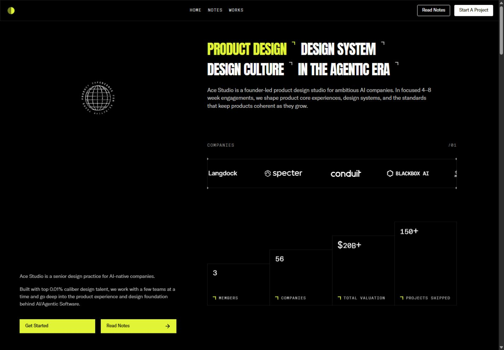
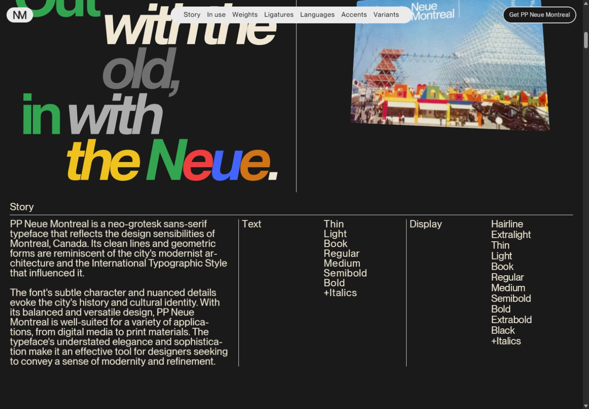
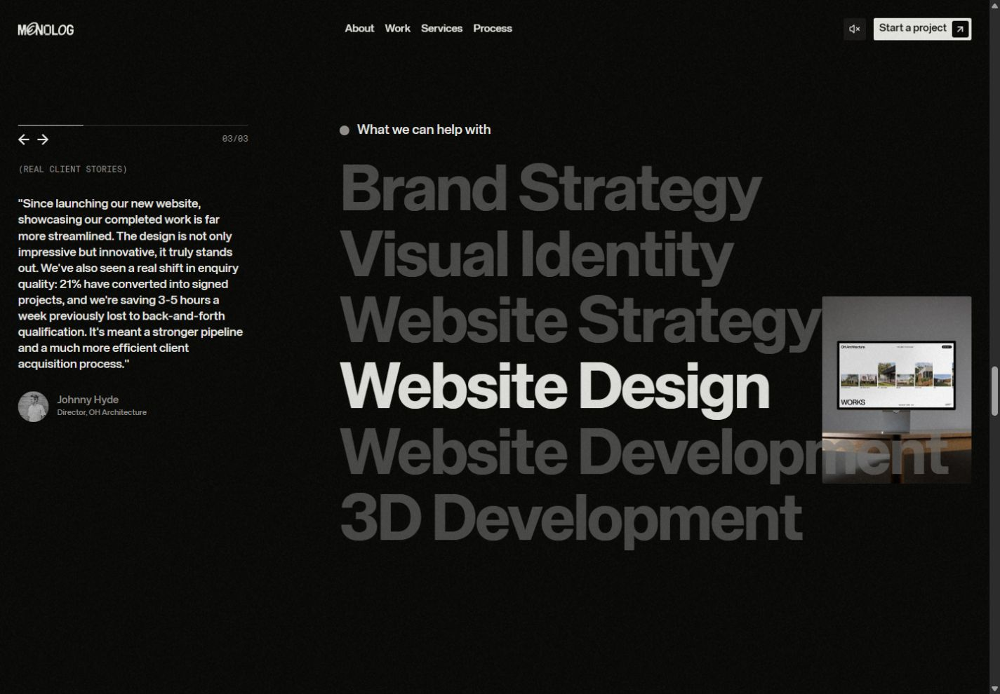
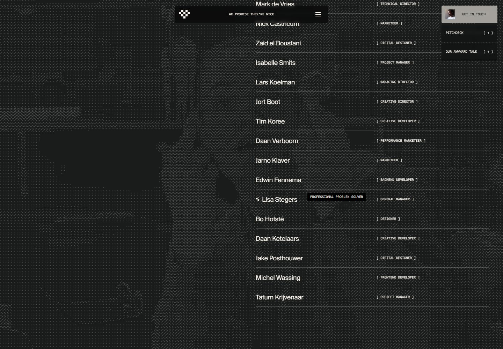
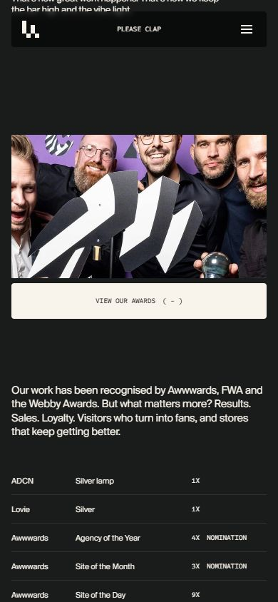

# Typography, hierarchy and pointer behavior

A second, focused pass across all five websites • September 15–16, 2026

This supplement examines how the sites direct attention, explain their offers, group information and reveal additional content under the pointer. It adds rendered measurements and live interaction evidence to the [main review](review.md).

## What was measured and tested

Type was sampled at **1440×1000 desktop** and **390×844 mobile** viewports. Values below are computed CSS pixels, rounded where appropriate, not estimates from screenshots. Font size and line height are separate measurements; a graphic wordmark or transformed specimen cannot reliably be described by the font size of its surrounding element.

I moved the pointer across titles, buttons, navigation, project imagery, postcards, service names, footer canvas regions and team rows. Browser pointer placement was paired with small wheel increments where needed. I checked the hovered element and resulting styles, alongside screenshots. This establishes hover responses; it does not establish physical-device touch behavior or a sustained mouse-button hold. Continuously animated backgrounds were not treated as proof of pointer response merely because successive frames differed.

The suggested reading orders are a creative-direction assessment based on size, placement, contrast and motion. They are not eye-tracking results. The [raw computed-style samples](typography-measurements.json) retain the measurements; they also include offscreen elements and animation wrappers, so the curated tables below are the appropriate reference for visible typography.

## Measured type hierarchy

Numbers shown as **size / line height**. Tracking is letter spacing, expressed in em where useful. These are observed roles at the tested widths, not an exhaustive design-token specification.

| Site and role | Typeface / weight | Desktop | Mobile | What the difference does |
|---|---|---|---|---|
| Ace service headlines | Anton 400 | 40 / 42 | 40 / 42 | Keeps the same emphatic type size; changes arrangement rather than scale |
| Ace explanatory heading | GT America Regular 400 | 16 / 22.4 | 16 / 22.4 | Reading size stays sensible, but the retained 640px box clips on mobile |
| Ace fixed-rail prose | GT America Light 300 | 14 / 21 | Rail removed | Quiet supporting context beside the dominant work stream |
| Ace chapter labels | GT America Mono Light 300 | 12 / 12 | 12 / 12 | +.1em spacing makes small labels feel like technical annotations |
| Arkon “Creative” | Bonheur Royale 400 | 161.54 / 80 | 121.15 / 80 | Script ascenders/descenders visually interlock with the following line |
| Arkon “Developer” | Bebas Neue 400 | 107.69 / 107.69 | 80.77 / 80.77 | Condensed capitals keep a forceful title within limited width |
| Arkon biography | JetBrains Mono 400 | 12 / normal | 12 / normal | The explanatory text remains small even when the mobile navigation grows |
| Arkon navigation | JetBrains Mono 300, active/hover emphasis | 12 / 16.8 | 16 / 22.4 | Mobile route links are easier to target/read than the biography |
| Neue cover title | PP Neue Montreal Bold 700 | 74.08 / 66.67 | 29.6 / 26.64 | Compact .9 leading makes the title a single graphic block |
| Neue cover explanation / Story label | PP Neue Montreal Text Regular 400 | 24 / 24 | 15 / 15 | Editorial density comes from 1.0 leading and −.03em tracking |
| MONOLOG hero positioning | KHTeka 500 | 17.75 / 19.53 | 14.11 / 15.52 | Small centered statement lets the wordmark and atmosphere dominate |
| MONOLOG founder statement | KHTeka 700 | 45 / 49.5 | 25.31 / 29.11 | A stronger reading beat immediately after the restrained hero copy |
| MONOLOG service names | KHTeka 700 | 94 / 94 | 33.31 / 33.31 | Large scale supplies hierarchy; hover adds another emphasis layer |
| MONOLOG process display | Animo, computed weight 500 | 139.5 / 125.55 | 83.72 / 75.35 | A distinct display voice marks a new chapter; rendered glyphs can be transformed |
| Lama hero headline | Suisse BP Intl 700 | 72 / 57.6 | 40 / 32 | .8 leading creates a dense, emphatic uppercase shape |
| Lama hero explanation | Suisse BP Intl 400 | 20.04 / 24.05 | 16 / 19.2 | Readable sentence rhythm contrasts with the tightly packed title |
| Lama mono action labels | Sometype 500 | 10 / 18 | 10 / 18 | Consistent instrument-like voice, but mobile labels remain very small |

Two distinctions matter. First, **computed weight is not proof of a separate font file**: a browser can synthesize a requested weight. Second, “headline” can describe visual prominence without meaning an HTML h1. Ace's 40px service terms are h3 elements, while its explanatory h1 is 16px. MONOLOG's semantic h1 is its small positioning statement, while the huge wordmark carries the strongest visual presence. That separation is not inherently wrong; it means visual hierarchy and document structure must be reviewed independently.

## Ace — information presented as a technical dossier

### Attention and reading order

The lime service phrase is the entry point, followed by the remaining condensed headlines, gray introduction and moving client strip. Project imagery then supplies proof. The persistent left rail forms a second reading lane: identity, a short explanation and booking/notes actions remain available while the portfolio scrolls.

This gives the desktop layout two functions at once: **the right side demonstrates capability; the left side preserves context and conversion**. The risk is divided attention. Both lanes explain who Ace is, while the projects require a separate downward journey. On mobile, removing the left lane reduces that duplication but also removes the ever-present invitation to act.

### Type, spacing and grouping

Anton at 40px with −.03em tracking looks dense and decisive. It creates more perceived emphasis than its numerical size alone suggests. The 16px explanation is substantially calmer, while the mono chapter labels have wide +.1em tracking and reduced opacity. These are three clear voices: statement, explanation and annotation.

The desktop introduction is 640px wide. The rail prose is 448px wide, with 21px leading on 14px text. Those line lengths and generous leading make the supporting copy reasonably comfortable on desktop. The mobile introduction's unchanged width is the implementation failure: its type size is fine, its container is not.

Project name and product category are separate lines below the image. The image answers “what does the work feel like?”, the name identifies it, and the category explains relevance. This is effective information compression. Testimonials are more difficult: small uppercase mono treats substantial proof like metadata. I would give the quotation more reading priority while keeping attribution in mono.

### Newly tested pointer details

- Hovering **Read Notes** changes its outlined dark treatment to lime with dark text. The alternate label/arrow treatment reinforces that the whole rectangle is interactive.
- Hovering the **Scout project image** produced a settled inner transform of **1.05 scale**. Moving away released the hovered state. The outer card retained its place in the grid, so the image zoom adds response without rearranging the reading order.
- Moving over the headline did not reveal additional explanatory content in this pass. It should be understood as a statement, not an undiscovered accordion.
- The ASCII/globe/portrait code still supports the behaviors documented in the first review. This pass did not produce reliable visual confirmation of the ASCII inversion or portrait pixelation, so those remain source-confirmed rather than upgraded to fully observed.

**Direction I would give the team:** retain the technical voice, but make meaningful proof easier to read. Fix the mobile text box and navigation first. Then distinguish the testimonial statement from its attribution, and keep a clear mobile contact action close to the work.

## Arkon — information placed around a demonstration

### Attention and reading order

The central sphere and the large role title compete for first attention. The biography sits to the right as a compact explanation, with a bright rectangular CTA below. Availability, technologies, time and social destinations occupy the perimeter. This resembles an exhibition label around a central object more than a conventional marketing page.

That is a coherent strategy for a creative developer: the sphere demonstrates a capability before the prose describes it. It is less efficient for visitors trying to answer a practical question such as which services are offered or how to contact the developer. Those answers depend on small peripheral text or entering another route.

### Type and hierarchy

The script's approximately 162px size is over thirteen times the biography's 12px size. “Developer” is about nine times that body size. Such a large jump makes the role memorable but heavily subordinates the explanation. The 80px line box under the taller script allows the two title styles to overlap visually as a deliberate lockup; it would be unsuitable as a general paragraph recipe.

JetBrains Mono gives the small information a consistent technical voice. Bold phrases within the biography identify the role and creative focus, so the paragraph has a scan path rather than one uniform texture. The right-side text block is about 320px wide in the mobile sample.

The mobile adaptation is revealing: route navigation increases from 12px to 16px, but the biography stays 12px. That is a local responsive decision, not a general increase in body size. Combined with the bright sphere behind it, the biography remains the weakest reading element. I would raise its size and provide a stable background before enlarging any other element.

### Newly tested pointer details

- **View My Work** reached a live **1.05 scale** on hover. Its bright fill makes the response easy to associate with the primary action.
- Hovering **Projects** strengthened the text toward white/600 and brought its arrow into view. Intermediate computed values showed the transition in progress; this was triggered without navigating.
- The pointer was moved across the wider scene. Its ambient movement makes frame comparison insufficient to isolate the lighting response. The spotlight interpolation remains supported by inspected code, not claimed as a separately proven visual effect in this pass.
- Several navigation/CTA elements are anchor-shaped DOM elements but were exposed as plain text in the inspected accessibility snapshot. This is a concrete reason to check href/role and keyboard activation; visual button treatment alone does not establish accessible link semantics.

**Direction I would give the team:** maintain the exhibition idea, but let practical information survive without competing with the exhibit. The 3D object can remain dominant while biography, contact and route controls have reliable contrast and semantics.

## Neue Montréal — editorial hierarchy becomes product education

### Attention and reading order

The cover establishes a publication metaphor: title, explanatory line, rules, a large product name and imagery. The name functions as a specimen, not merely a label. Subsequent chapters alternate an emotional typographic statement with a more structured explanation of the family.

In the Story section, the left column explains the typeface while the middle and right columns list Text and Display weights. The sizes are deliberately similar. **Position, alignment and rules—not a bigger title on every column—carry the hierarchy.** This is why the dense page still feels organized.

The sequence also answers progressively more specific questions: what is it, where does it come from, how does it look in use, what weights exist, how do optical styles differ, which glyphs/languages are supported, and where can it be obtained. That is a stronger information architecture than a series of unrelated visual demos.

### Type and reading density

The cover title measured 74.08px/66.67px at 1440px wide and 29.6px/26.64px at 390px. Explanatory/Story styles measured 24px/24px and 15px/15px, with −.03em tracking. This creates a compact printed texture. It is visually convincing, but the 1.0 leading is tighter than I would choose for sustained prose on a general information site.

The huge word specimens and logos may be SVG artwork or transformed components. Treating their surrounding element's font size as the visible glyph size would be misleading. The visual contrast comes from the final letterform bounds, not just CSS tokens.

At 1440×1000, the cover resolved cleanly into separate title and explanatory bands. The overlap documented at 1280×720 remains a narrower/shorter-viewport observation, not a universal description of the cover.

### Newly tested pointer details

- Moving over the **postcard image** produced a live 3D transform and enlarged/tilted the card toward the pointer. Its perspective makes it feel like a printed object held in space. This upgrades the earlier source-confirmed tilt to observed behavior.
- The **purchase control** animates individual letters vertically on hover. A hovered letter was measured partway through its upward translation. It preserves the label while introducing motion, rather than replacing the CTA with unrelated text.
- The postcard's pointer cursor suggests additional interaction, but this pass did not establish a separate click outcome. Do not infer a flip or navigation purely from that cursor.

**Direction I would give the team:** preserve the editorial density and typographic comparisons. Add a compact mobile chapter index, and ensure every specimen control has meaningful keyboard behavior and selected-state labeling. The page should support both leisurely exploration and direct reference.

## MONOLOG — small positioning, large proof, active emphasis

### Attention and reading order

The hero gives first priority to atmosphere and the graphic wordmark. Its meaningful h1 is intentionally small: a two-part positioning statement centered in a roughly 252px desktop box, reduced to about 200px on mobile. That builds intrigue, but the practical offer asks for closer reading.

The following founder statement is much larger, and the page then moves through work, service capability, process, objections and contact. This is a deliberate persuasive sequence: establish a point of view, substantiate it, explain the engagement, then answer practical concerns.

The work presentation separates project image, brief context, service information and results. This lets a visitor scan visually and then choose whether to read. The service section places customer testimony alongside the large capability list, pairing “what we do” with “why believe us.”

### Type and local hierarchy

KHTeka moves from approximately 17.75px/19.53px hero copy to 45px/49.5px founder copy and 94px/94px service names. Mobile values are about 14.11px, 25.31px and 33.31px respectively. The hero therefore stays noticeably restrained compared with the page's later statements.

The 94px service names use −.03em tracking; their silhouette becomes a major graphic element. Suisse Mono annotations are around 11.8px in the measured desktop service section, which clearly distinguishes supporting labels from persuasive content. Animo's much larger process display creates a chapter break through letterform personality as well as size.

There is also a **dynamic hierarchy**: the hovered service has opacity 1 while the other five sit at .3. This is far more consequential than a decorative hover color; it tells the visitor which item the adjacent image belongs to.

### Newly tested pointer details

- Hovering **Website Design**, then **3D Development**, changed the active text and contextual preview. This was verified by both the screenshot and the corresponding opacity changes.
- The testimonial beside the service list advanced while the page remained there. Its progression is independent of the service hover, so the quote should not be interpreted as a one-to-one testimonial for the selected service.
- The footer's **Hold to disrupt** prompt follows the pointer. Moving from one canvas region to another moved the label from approximately x=252 to x=1081. Leaving for an AI icon removed it from the canvas area.
- That confirms the instructional cursor behavior. The exact sustained-press distortion remains incompletely exercised; ordinary ambient canvas motion is not sufficient evidence of the hold effect.

**Direction I would give the team:** preserve the contrast between quiet positioning and large proof. Make sure the hero statement stays comfortably readable on mobile. Keep service emphasis linked clearly to the preview, and avoid making an independently cycling testimonial appear contextually tied to that same hover.

## Lama Lama — broad statements, precise labels, people on demand

### Attention and reading order

The hero combines a cinematic environment with a dense uppercase declaration. The explanatory paragraph sits separately on desktop and directly below on mobile. The headline establishes attitude; the paragraph supplies the broader offer; the work and service sections provide specificity.

The portfolio rows are a compact information system: **name → classification tags → visual samples → expand/open action**. A visitor can assess many projects without first opening every case. Full cases then use narrative, credits and media in a more detailed sequence. This distinction between index and detail is one of the site's strongest organizational choices.

On About, names and roles are presented as a list rather than a grid of headshot cards. Hover reveals a full-page portrait and an informal personality caption. The list stays compact while the image supplies presence. The tradeoff is that portraits and captions are transient; they should remain supplementary to the stable names and roles.

### Type and information density

The hero uses 72px type with 57.6px line height on desktop, and 40px with 32px line height on mobile. That .8 leading deliberately compresses the title into a solid block. The explanation uses about 20px/24px and 16px/19.2px respectively, giving sentences more room than headlines.

The desktop headline box is about 783px wide and its explanation about 322px. On mobile, they become 358px and 297px. This is a more complete responsive adjustment than shrinking the type alone: the reading measure and spatial relationship both change.

Mono labels remain 10px/18px with −.02em tracking. Brackets distinguish metadata; outlines, arrows and filled states distinguish actions. That consistency is attractive, but it places a lot of work on subtle shape cues because labels and actions often share the same small type treatment. I would preserve the mono voice while considering a larger mobile size for important actions.

### Newly tested pointer details

- Hovering **Lisa Stegers** changed the background portrait, marked the active row and revealed “Professional problem solver” near the pointer.
- Moving to **Tim Koree** changed the portrait/row and the caption to “Climbs things. Builds things.” These are personalized discovery details, not generic cursor text.
- The **Get in touch** card swaps its label layers on hover, consistent with the site's shared mono-reveal button system. The empty hero was also probed; its constantly changing media makes it inappropriate to label every visible change as a cursor effect.
- The awards image revealed a **Keep holding for glory** instruction. Inspection of the actual awards module confirms that desktop mousedown shows the awards/description and mouseup hides them. A prolonged hold was not exercised through the available controls.
- On mobile, the same awards information has a **View our awards** button. I opened it and verified an expanded description and award table, with the plus changing to minus. This is a particularly good touch alternative: the user can read the information without maintaining a press.

The [public awards module](https://lamalama.com/wp-content/themes/lamalama2025/dist/assets/awards--Ih5a6BC.js) staggers award reveals by .035 seconds. Its mobile panel opens over 1.25 seconds and closes over .85 seconds. The key design distinction is the interaction model: temporary press-and-hold revelation on desktop, persistent disclosure on mobile.

**Direction I would give the team:** retain the index/detail structure and personalized team discovery. Use the awards adaptation as the standard for other hidden content: preserve the idea while giving touch users a stable, readable state. Treat small labels and modal exits as functional design decisions, not finishing details.

## Information hierarchy compared

| Site | Primary attention | Explanatory information | Proof and detail | What interaction adds |
|---|---|---|---|---|
| Ace | Condensed service statements and lime | Gray studio introduction; persistent rail | Project grid, counters, testimonials, principles | Small feedback and technical texture; limited new content on hover |
| Arkon | 3D object and role title | Compact biography; perimeter metadata | Project descriptions and image galleries | Scene continuity and button/link feedback |
| Neue Montréal | Giant specimens and editorial statements | Ruled columns, family labels and narrative | Weight controls, optical comparisons, languages and glyphs | Demonstrates product properties and reveals editorial stories |
| MONOLOG | Wordmark, atmosphere, then large statements | Small positioning statement; project/process copy | Outcomes, testimonials, FAQs | Changes local emphasis and supplies contextual previews |
| Lama Lama | Uppercase declaration and cinematic media | Supporting paragraphs and micro labels | Compact work index, case detail, people and awards | Reveals previews, portraits, personality captions and alternative presentation modes |

Three levels should be kept distinct when borrowing ideas from these sites. **Page hierarchy** determines which chapters matter. **Component hierarchy** determines how a project, quote or service is understood. **Interaction hierarchy** changes what is emphasized or revealed as the visitor acts. MONOLOG's service list and Lama's team list are clear examples of the third level.

## What this adds to the original review

- Rendered desktop/mobile type measurements, line heights, tracking and text-box widths.
- A distinction between visual prominence and HTML heading structure.
- Site-specific reading-order and information-grouping analysis.
- Live confirmation of Ace project zoom, Arkon CTA/nav response, Neue postcard/button behavior, MONOLOG service emphasis and cursor-following instruction, and Lama team captions.
- A newly documented desktop hold/mobile disclosure pattern for Lama's awards.
- Explicit boundaries for continuously animated canvases and effects that remain source-only.

The strongest takeaway is that **hierarchy is not simply a descending list of font sizes**. Alignment can make equally sized text understandable; contrast can turn a list into a selection interface; a hover can introduce a temporary layer of detail. The successful examples preserve a stable reading structure beneath those changes.
